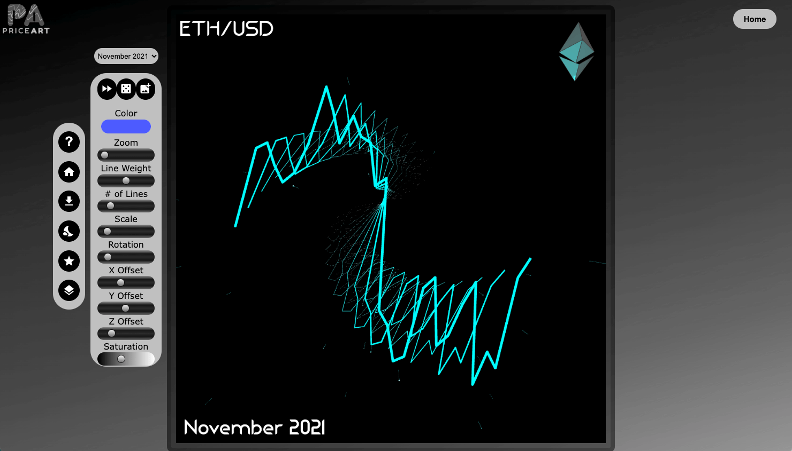

# ETH-PriceArt-explorer
A visual homage to Ethereum. Find the collection on [opensea!](https://opensea.io/collection/ethusd)

This was a successor to the PriceArt ADA collection. Each NFT is a artistic line graph interperpritation of a month of historical Ethereum ETH/USD price action. There are a few rare NFT's that include an entire year of price data. This project was created using the p5.js graphics library as well as vanilla JavaScript, HTML, and CSS to make the explorer itself. I created this project in November of 2021, when I thought it would be a good idea to use p5.js as a frontend framework lol. If I were to do it again, there is a lot I would've done differently, but I'd defiinitely use React to display these beautiful NFTs, that would have saved me a lot of time. Ultimately, I didn't sell these well enough so it was a bit of a flop, but hey, at least they are gorgeous!

This code is not particularly well organized, or nor is it 'clean code' per se. It was a wonderful learning project for me and I am still proud of how well it works despite being such a chaotic code base. Lots of lessons learned here. 

If you want to fork this and play with it, feel free to!
